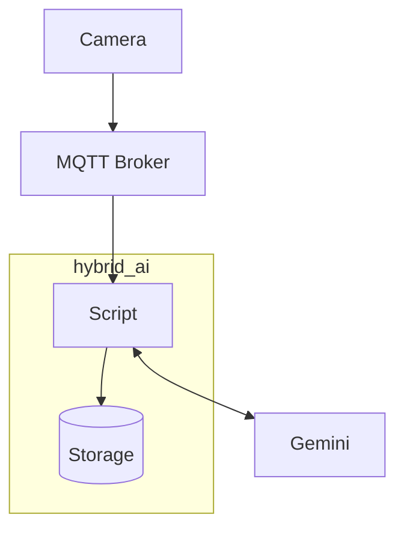

# hybrid_ai
Send "Best Snapshots" from Axis Scene Analytics to Gemini for further
analysis. The purpose is to show the use of edge preprocessing to get the objects and the cloud for
deeper analysis.

It works by listening to Consolidated Tracks which come with a Best Snapshot.
Components involved:



It requires a number of things to be set up first. The instructions below take some
shortcuts. These are fine if you do not regularly use MQTT or Python. You will
know what to do when you do.

## Settings
The script needs a bunch of parameters, like the Gemini API key and MQTT connection details. All
can be specified on commandline but it is more convenient to create a settings
file called ```environment.env```. It will be read by the script at startup.

```
cp environment.env.example environment.env
nano environment.env
```


## Gemini account
 - [Get yourself an API key](https://ai.google.dev/gemini-api/docs/api-key)
 - [Make the key available](https://ai.google.dev/gemini-api/docs/api-key#set-api-env-var) by setting an environment variable or adjusting ```environment.env```


## MQTT Broker
 - You can use a public one like [Hive MQ](https://www.hivemq.com/mqtt/public-mqtt-broker/)
 - This script was tested with a local [Mosquitto](https://mosquitto.org/)
 - On Ubuntu, use this command to install. It will not give you the latest one
   but that's fine
   ```
   sudo apt install mosquitto
   ```
 - You can use the example mosquitto configuration from this repository. Install
   it as follows. It's a bit untidy by overwriting the main mosquitto.conf
   file:
   ```
   sudo cp mosquitto.conf /etc/mosquitto/mosquitto.conf
   ```
 - Initialize the Mosquitto password file with an initial user. Store the same credentials
   in the ```environment.env``` file so that the script can find them
   ```
   sudo mosquitto_passwd -c /etc/mosquitto/passwd <username>
   ```
 - If adding more users, do not use the -c argument. Use ```mosquitto_passwd -h``` first to see
   details
 - Restart mosquitto
   ```
   sudo systemctl restart mosquitto
   ```


## Camera setup
A number of steps is required to setup the camera. It's recommended to upgrade
to the latest Axis OS version first. This script was tested against Axis OS 12.5 and
12.6. Some API calls must be performed, but fortunately this can be done
interactively through the Swagger UI. This can be found on the device at
System -> Plain Config.

 - [Configure MQTT Broker connection](https://help.axis.com/en-us/axis-os-knowledge-base#mqtt)
 - [Enable Scene Metadata over MQTT](https://developer.axis.com/analytics/axis-scene-metadata/how-to-guides/scene-metadata-over-mqtt/)
   The default topic name expected by the script is 'track_topic'
 - [Enable Best snapshots](https://developer.axis.com/analytics/axis-scene-metadata/how-to-guides/best-snapshot-start/)

Now you can check on commandline if the camera is emitting tracks on MQTT:

```
mosquitto_sub -h 127.0.0.1 -t track_topic -u <mqtt_username> -P <mqtt_password>
```


## Python setup
Some non-standard modules are required. Install as follows:

```
python3 -m pip install -r requirements.txt
```

If you're new to Python you may run into some problems. You can take these
steps to fast forward:

 - Some distributions come without pip. It needs to be installed using the
   package manager. On Ubuntu:
   ```
   sudo apt install python3-pip
   ```
 - You may get an error message that the install may break system packages. This
   can be workarounded as follows, but carefully note first you _must_ run
   this _without_ sudo in front so that the modules will be installed locally
   in your user account.  Thus, no system packages will be broken. If you
   already typed 'sudo', remove it, then copy/paste this command:
   ```
   python3 -m pip install --break-system-packages -r requirements.txt
   ```


Then, finally, you can run the script:

```
python3 hybrid_ai.py
```

You can start playing around by terminating the script and modify code in TracksHandler.handle.
