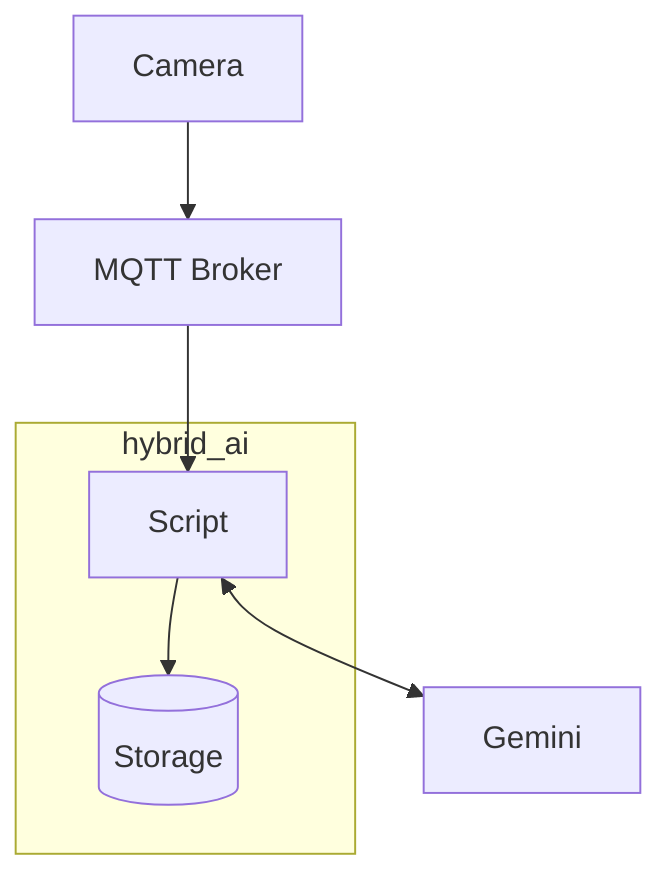

# hybrid_ai
This script demonstrates how to receive "Best Snapshots" from Axis Scene Analytics and send 
them to Gemini for further analysis. By doing that, it is an example of hybrid AI: Use edge 
preprocessing for the bulk work of extracting objects of interest, then forward only relevant 
material to the cloud for deeper analysis beyond capabilities of the edge.

It works by listening to Consolidated Tracks which come with a Best Snapshot.
Components involved:



This example assumes Linux but can be made to run in WSL, some notes at the end of this file. 
Tested on Ubuntu 22 and 24, using Python 3.10, 3.11 and 3.13. Next to working with Consolidated 
Tracks it does an attempt to bring some efficiency:


- Save your results (images and classifications)
- Continue file numbering between runs


It requires a number of components to be set up first. The instructions below take
shortcuts. These are fine if you do not regularly use MQTT or Python. Adjust according 
to your needs when you do have specific requirements.

## Settings
The script needs several parameters, for example: a Gemini API key and MQTT connection details. All
can be specified on commandline but it is more convenient to create a settings file called 
```environment.env```. It will be read by the script at startup. To get started quickly copy the 
example file and adjust it to your local needs:

```
cp environment.env.example environment.env
nano environment.env
```


## Gemini account
 - [Get yourself an API key](https://ai.google.dev/gemini-api/docs/api-key)
 - [Make the key available](https://ai.google.dev/gemini-api/docs/api-key#set-api-env-var) by setting an environment variable or adjusting ```environment.env```


## MQTT Broker
 - You can use a public one like [Hive MQ](https://www.hivemq.com/mqtt/public-mqtt-broker/)
 - This script was tested with a local [Mosquitto](https://mosquitto.org/). The following instructions are for installing Mosquitto.
 - On Ubuntu, use this command to install. The default version is fine for our usecase
   ```
   sudo apt install mosquitto
   ```
 - You can use the example mosquitto configuration from this repository. Install
   it as follows. Do notice the hackish approach of overwriting the main mosquitto.conf
   file:
   ```
   sudo cp mosquitto.conf /etc/mosquitto/mosquitto.conf
   ```
 - Initialize the Mosquitto password file with an initial user. Store the same credentials
   in the ```environment.env``` file so that the script can find them
   ```
   sudo mosquitto_passwd -c /etc/mosquitto/passwd <username>
   ```
 - Note: -c means create. When adding more users, do not use the -c argument again as you will lose the existing users. 
   Use ```mosquitto_passwd -h``` for an explanation of the options.
   
 - Restart mosquitto
   ```
   sudo systemctl restart mosquitto
   ```


## Camera setup
A number of steps is required. It's recommended to upgrade
to the latest Axis OS version first. This script was tested against Axis OS 12.5 and
12.6. Some API calls must be performed, but fortunately this can be achieved
interactively through the Swagger UI. This can be found on the device at
System -> Plain Config.

 - [Configure MQTT Broker connection](https://help.axis.com/en-us/axis-os-knowledge-base#mqtt)
 - [Enable Scene Metadata over MQTT](https://developer.axis.com/analytics/axis-scene-metadata/how-to-guides/scene-metadata-over-mqtt/)
   The default topic name expected by the script is 'track_topic'
 - [Enable Best snapshots](https://developer.axis.com/analytics/axis-scene-metadata/how-to-guides/best-snapshot-start/)

Now you can check on commandline if the camera is emitting tracks on MQTT. This command 
assumes a locally running MQTT broker, change the IP address when you are running the 
broker elsewhere:

```
mosquitto_sub -h 127.0.0.1 -t track_topic -u <mqtt_username> -P <mqtt_password>
```


## Python setup
Some non-standard modules are required. Install as follows:

```
python3 -m pip install -r requirements.txt
```

If you're new to Python you may run into some problems. You can take these
steps to fast-forward:

 - Some distributions come without pip. It needs to be installed using the
   package manager. On Ubuntu:
   ```
   sudo apt install python3-pip
   ```
 - You may get an error message stating that the install may break system packages. This
   can be workarounded as follows, but carefully note first you _must_ run
   this _without_ sudo in front so that the modules will be installed locally
   in your user account.  That way, no system packages will be broken despite
   that message. If you already typed 'sudo', remove it now, then copy/paste
   this command:
   ```
   python3 -m pip install --break-system-packages -r requirements.txt
   ```
- Alternatively, create a virtual env to run the script


Then, finally, you can run the script:

```
python3 hybrid_ai.py
```

You can start playing around by terminating the script and modify code in TracksHandler.handle.

## Deployment alternatives

The following sections describe some deployment alternatives: 

- The use of MQTT over Websockets
- Running this example on Windows WSL

These aspects have nothing to do with the script itself. However, such things can be, mildly phrased, 
cumbersome to get right and there is a good chance it has relevance for at least some of the readers.


### MQTT over Websockets
The Axis devices support tunneling MQTT over (secure) websockets. In case you already have a secured webserver in place 
this is great to achieve several benefits at once:

- Secure traffic
- No additional certificate management
- No additional open ports and/or firewall configuration work

The supplied Mosquitto configuration already enables listening for websocket traffic. The only now required is 
to configure your webserver to proxy a url to the Mosquitto backend. Let's chose ```wss://<yourdomain>>/mqtt/```. 
This is the url that you will need to configure on the device. For the webserver, in case of ```nginx``` the 
configuration will look like:

```nginx
 upstream my_mqtt_server {
    server localhost:9001;
 }

server {
    listen 443 ssl;
    server_name <yourdomain>;
	...
	// All the other configuration
	...
    location /mqtt/ {
       proxy_pass http://my_mqtt_server;
       proxy_http_version 1.1;
       proxy_set_header Upgrade $http_upgrade;
       proxy_set_header Connection "upgrade";
       proxy_set_header Host $host;
    }
}
```
For Apache or other webservers the details will of course be different.


### WSL (Windows Subsystem for Linux)
To run this example on Windows Subsystem for Linux using a local Mosquitto install, it's advised to use 
"mirrored networking mode". 

Mirrored network mode allows the Windows host and Linux virtual machine to share the same external IP 
address. This enables the camera to reach the broker from the outside, through the Windows host into 
the Linux guest.

It is enabled by creating a configuration file in 
a specific location. To get there, type %UserProfile% in the Windows Explorer location bar.

Here, create a file `.wslconfig`:

```ini
[wsl2]
networkingMode = mirrored
```

## Installation
- Enable WSL by opening cmd.exe or Powershell as Administrator and type `wsl
  --install`
- Install a Linux distribution through Microsoft app store. This script was tested on Ubuntu 24.04 on WSL
- Note: After download, in case your windows configuration uses another drive
  than C: for your Downloads folder, you will run into a problem when starting Linux. If so, after download immediately
  move the app to C:. This is a simple task, go to Installed Apps, select the Linux app and chose ‘Move’.
- Configure mirrored networking (see above)
- Start WSL by double clicking the Ubuntu icon

## Connectivity check
**Important:** One gotcha is that despite the mirroring, he
Linux side is not reachable on the Windows side using the external IP address. You need to use
127.0.0.1 (localhost) instead. From other machines however, one can reach the
services running in the WSL Linux without problem, using the IP address of the
Windows host.

Perform a basic connectivity check directly after install so that the networking part can be ruled out later.
On Ubuntu, use Python to start an ad-hoc webserver. It makes sense to make it use
port 1883 as that is the port that will be used by Mosquitto. But any port will do, as long as you use the same number on the Windows side.
For "well known" portnumbers, like 80 for web, you need to type ```sudo``` in front of the command.
```
python3 -m http.server -b 0.0.0.0 1883
```

On the Windows host, open Windows Powershell and try:

```cmd
curl http://127.0.0.1:1883
```

Or use the browser and type the url there. This should yield some filelist content of the
directory where the http server was started. When there is an error instead, try to
solve this first. Then try the same from another host, now using the
external IP address of the Windows device. Kill the http.server program before continuing with Mosquitto install.
